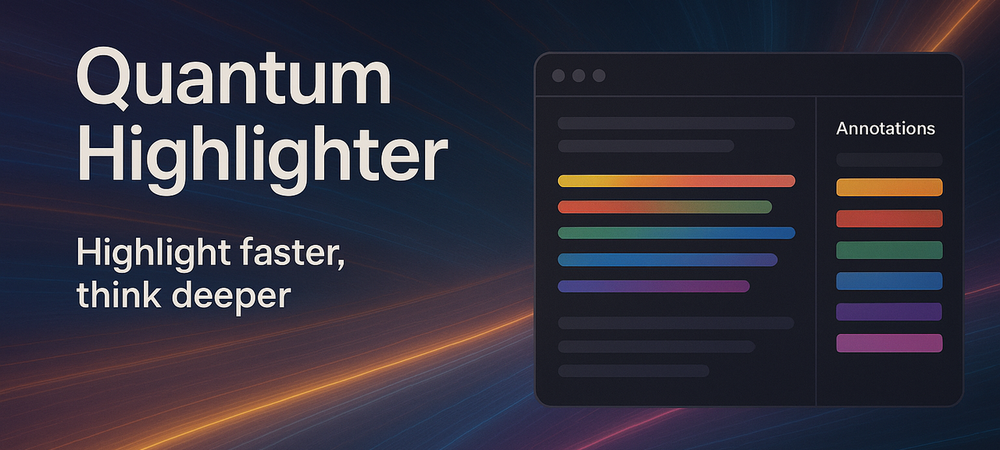
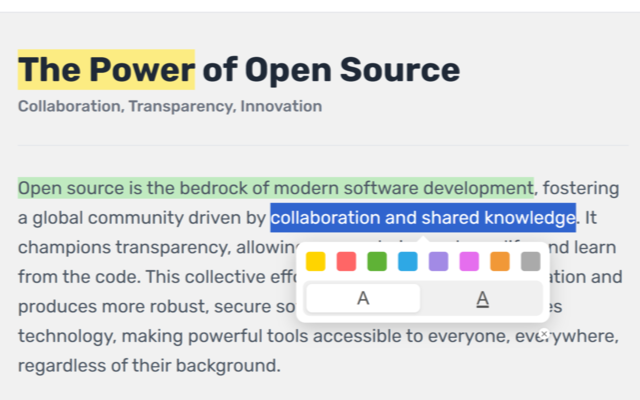
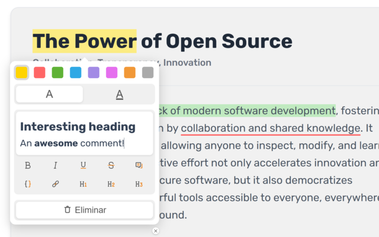

# Quantum Highlighter PRO

A powerful, open-source web annotation extension for Chrome, inspired by Zotero's annotation system. Highlight, underline, and manage annotations with rich-text comments on any webpage.

## Key Features

### 🎨 Advanced Annotation System

*   **Two Annotation Types:** Choose between highlighting text with a background color or underlining it.
*   **Eight Colors:** A palette of 8 colors to organize your notes (yellow, red, green, blue, purple, pink, orange, gray).

    
*   **Robust & Dynamic:** Annotations persist reliably, even on dynamic websites like YouTube, thanks to a `MutationObserver`-based re-application system.
*   **SPA Compatibility:** Advanced support for Single Page Applications (SPAs) with intelligent URL change detection and annotation management.
*   **Smart URL Handling:** Intelligent parameter filtering for consistent annotation storage across different URL variations.

### 📝 Rich-Text Comments

*   **Full-Featured Editor:** Powered by **Tiptap**, the comment editor supports rich formatting.
*   **Formatting Toolbar:** Includes tools for **bold**, *italic*, <u>underline</u>, ~~strikethrough~~, links, code blocks, quotes, and headings (H1, H2, H3).
*   **Smart Link Tool:** Create and edit links with a custom modal. Hover over links to see their URL, and `Ctrl+Click` to open them in a new tab.
*   **Dynamic Placeholders:** Context-aware help text guides you as you write.

### 🔧 Intelligent Sidebar
*   **Centralized Management:** A dedicated panel to view and manage all your annotations for the current page.
*   **Page Metadata:** The sidebar displays the page's title, description, domain, and favicon for context.
*   **Click-to-Scroll:** Instantly navigate to any annotation on the page by clicking its card in the sidebar.
*   **Resizable & Lockable:** Drag the edge to resize the sidebar and lock its width to your preference.

### ⚙️ Advanced Configuration
*   **Granular Control:** Disable the extension on a specific page or an entire website.
*   **Force Dark Text:** An option to force black text on highlights to ensure readability on any background.
*   **Smart Persistence:** All your settings and annotations are synchronized across devices using `chrome.storage.sync`.

### 🌍 Full Internationalization (i18n)
*   **Multi-Language Support:** The entire interface is professionally translated into 6 languages:
    *   **English** _(en)_
    *   **Spanish** _(es)_
    *   **French** _(fr)_
    *   **Portuguese (Brazil)** _(pt_BR)_
    *   **Russian** _(ru)_
    *   **Chinese (Simplified)** _(zh_CN)_
*   **Localized Placeholders:** All help texts are culturally adapted.

### ⌨️ Optimized User Experience
*   **Smart Context Menus:** Annotation menus are intelligently positioned using **Floating UI** to prevent them from going off-screen.
*   **Precise Selection:** Automatically trims leading/trailing whitespace from selections to keep your notes clean.
*   **Intuitive Shortcuts:** A comprehensive set of keyboard shortcuts for a faster workflow.

## Keyboard Shortcuts

| Shortcut | Action | Context |
| :--- | :--- | :--- |
| `Ctrl+Shift+H` | Toggle the sidebar | Global |
| `Esc` | Close annotation menu or cancel selection | On-Page |
| `Delete` | Delete the selected annotation | On-Page |
| `Ctrl+Click` | Open link in a new tab | On a link in a comment |
| `Ctrl+B` | Toggle **Bold** | Comment Editor |
| `Ctrl+I` | Toggle *Italic* | Comment Editor |
| `Ctrl+U` | Toggle <u>Underline</u> | Comment Editor |
| `Ctrl+Shift+X` | Toggle ~~Strikethrough~~ | Comment Editor |
| `Ctrl+K` | Add/Edit Link | Comment Editor |
| `Ctrl+Shift+7` | Toggle Blockquote | Comment Editor |
| `Ctrl+Shift+8` | Toggle Code Block | Comment Editor |
| `Ctrl+Alt+1` | Toggle Heading 1 | Comment Editor |
| `Ctrl+Alt+2` | Toggle Heading 2 | Comment Editor |
| `Ctrl+Alt+3` | Toggle Heading 3 | Comment Editor |

## Installation

### From the Chrome Web Store (Recommended)
Install the extension directly from the Chrome Web Store for the most stable version and automatic updates.

> **📋 Note:** The Chrome Web Store listing is currently under review. The extension will be available soon!

[**➡️ Install from Chrome Web Store**](https://chrome.google.com/webstore/detail/mock-link-for-quantum-highlighter) _(Coming Soon)_

### Manual Installation (for Developers)
If you prefer to install manually or want to test the latest development version:

1.  **Download:** Download or clone this repository.
2.  **Open Chrome:** Navigate to `chrome://extensions/`.
3.  **Enable Developer Mode:** Turn on the "Developer mode" toggle in the top-right corner.
4.  **Load the Extension:** Click "Load unpacked" and select the `chrome_extension` folder from this repository.
5.  **Done!** The extension icon will appear in your toolbar.

## Usage

### Creating Annotations
1.  **Select Text:** Drag your mouse over any text on a webpage.
2.  **Choose Type & Color:** A floating menu will appear. First, select the annotation type (highlight or underline), then choose one of the 8 available colors.
3.  **Annotation is Created:** The annotation is instantly created and saved.

### Editing Annotations & Adding Comments
1.  **Click an Annotation:** Click on any existing highlight or underline on the page.
2.  **Edit Menu:** The context menu will appear, allowing you to change the color, type, or delete the annotation.
3.  **Add a Comment:** Use the integrated Tiptap editor to write and format your comments. Changes are saved automatically.

### Managing from the Sidebar
1.  **Open Sidebar:** Click the extension icon or use the `Ctrl+Shift+H` shortcut.
2.  **Navigate Annotations:** See all annotations organized in a list.
3.  **Scroll to, Edit, or Delete:** Click any annotation card to scroll to its position on the page. Use the buttons on the card to edit or delete it.
4.  **Adjust Width:** Drag the left edge to resize the sidebar and use the lock icon to fix its size.

## Technology Stack

*   **Chrome Extension Manifest V3:** Modern, secure, and performant extension architecture.
*   **Vanilla JavaScript (ES6+):** No heavy frameworks for the core logic, ensuring a lightweight footprint.
*   **Tiptap:** A headless, framework-agnostic rich-text editor for advanced comments.
*   **Floating UI:** A powerful library for intelligently positioning floating elements like context menus.
*   **Custom i18n System:** A dependency-free internationalization system.

## Privacy and Security

The extension is designed with your privacy in mind. All your data is stored locally on your device. For more details, please see the following documents:

*   **[Privacy Policy](PRIVACY_POLICY.md):** Understand how your data is handled.
*   **[Permissions and Data Usage](PERSMISSIONS_AND_DATA_USAGE.md):** A detailed explanation of the permissions requested by the extension.
*   **[Security Policy](SECURITY.md):** Our commitment to keeping the extension secure.

## Contributing

Contributions are welcome! Please:

1.  **Fork** the repository.
2.  **Create** a feature branch (`git checkout -b feature/new-feature`).
3.  **Commit** your changes (`git commit -am 'Add some new feature'`).
4.  **Push** to the branch (`git push origin feature/new-feature`).
5.  **Open** a Pull Request.

### Areas for Contribution
*   🌍 **Translations** into new languages or improving existing ones.
*   🎨 **UI/UX improvements**.
*   🐛 **Bug fixes**.
*   📚 **Documentation**.
*   ⚡ **Performance optimizations** and code refactoring.

### Support the Project
Quantum Highlighter PRO is a free, open-source project developed with love in my spare time. If you find the extension useful, please consider making a donation to support its continued development and maintenance.

[**❤️ Donate via PayPal**](https://www.paypal.com/ncp/payment/P8GZGDP6GQBB2)

## License

This project is licensed under the [Creative Commons Attribution-ShareAlike 4.0 International License](LICENSE). This means you are free to:

*   **Share:** Copy and redistribute the material in any medium or format.
*   **Adapt:** Remix, transform, and build upon the material for any purpose, even commercially.

Under the following terms:

*   **Attribution:** You must give appropriate credit, provide a link to the license, and indicate if changes were made.
*   **ShareAlike:** If you remix, transform, or build upon the material, you must distribute your contributions under the same license as the original.

---

**Developed with ❤️ by [Jorge Antonio Gómez](https://github.com/Jorge-Antonio-Gomez)**